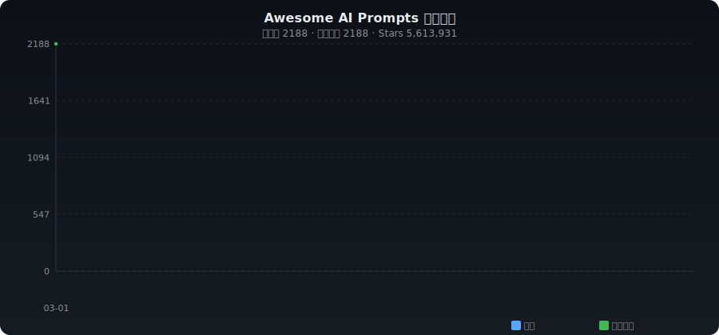

# ✨ Awesome AI Prompts

**English** | [中文](./README_ZH.md)

> Curated collection of AI prompts, system prompts & prompt engineering — auto-collected from GitHub

   

---

## 📈 Trends

---

## 📊 Category Stats

| Category | Count | Share |
|----------|------:|------:|
| 📚 Prompt Collections | 529 | ███████ 21.6% |
| 🎯 System Prompts | 126 | █ 5.1% |
| 🔬 Prompt Engineering | 716 | █████████ 29.2% |
| 🔧 Tools & Management | 309 | ████ 12.6% |
| 💻 Coding & Development | 157 | ██ 6.4% |
| ✍️ Writing & Content | 25 | █ 1.0% |
| 📊 Business & Analysis | 51 | █ 2.1% |
| 🎓 Education & Learning | 154 | ██ 6.3% |
| 🎨 Image Generation | 142 | █ 5.8% |
| 🔓 Jailbreak & Experimental | 34 | █ 1.4% |
| 📦 Others | 206 | ██ 8.4% |

---

## 🔥 Daily Trending (2026-03-01)

| # | Project | ⭐ | 📈 Gain | Description |
|:-:|---------|---:|-------:|-------------|
| 1 | [gsd-build/get-shit-done](https://github.com/gsd-build/get-shit-done) | 22,634 | +166 | A light-weight and powerful meta-prompting, context engineer |
| 2 | [x1xhlol/system-prompts-and-models-of-ai-tools](https://github.com/x1xhlol/system-prompts-and-models-of-ai-tools) | 126,733 | +109 | FULL Augment Code, Claude Code, Cluely, CodeBuddy, Comet, Cu |
| 3 | [ykdojo/claude-code-tips](https://github.com/ykdojo/claude-code-tips) | 3,724 | +84 | 45 tips for getting the most out of Claude Code, from basics |
| 4 | [f/prompts.chat](https://github.com/f/prompts.chat) | 149,439 | +71 | f.k.a. Awesome ChatGPT Prompts. Share, discover, and collect |
| 5 | [asgeirtj/system_prompts_leaks](https://github.com/asgeirtj/system_prompts_leaks) | 33,356 | +44 | Collection of extracted System Prompts from popular chatbots |
| 6 | [Nagi-ovo/gemini-voyager](https://github.com/Nagi-ovo/gemini-voyager) | 8,562 | +39 | An all-in-one enhancement suite for Google Gemini & AI Studi |
| 7 | [liyupi/ai-guide](https://github.com/liyupi/ai-guide) | 8,511 | +39 | 程序员鱼皮的 AI 资源大全 + Vibe Coding 零基础教程，分享大模型选择指南（DeepSeek / GPT  |
| 8 | [dongshuyan/Awesome-Prompts](https://github.com/dongshuyan/Awesome-Prompts) | 490 | +36 | 分享一下自创以及打野得到的各种优质prompt |
| 9 | [linshenkx/prompt-optimizer](https://github.com/linshenkx/prompt-optimizer) | 22,457 | +31 | 一款提示词优化器，助力于编写高质量的提示词 |
| 10 | [github/awesome-copilot](https://github.com/github/awesome-copilot) | 23,031 | +22 | Community-contributed instructions, prompts, and configurati |
| 11 | [microsoft/generative-ai-for-beginners](https://github.com/microsoft/generative-ai-for-beginners) | 107,294 | +20 | 21 Lessons, Get Started Building with Generative AI |
| 12 | [mco-org/mco](https://github.com/mco-org/mco) | 76 | +19 | Orchestrate AI coding agents. Any prompt. Any agent. Any IDE |
| 13 | [ashishps1/learn-ai-engineering](https://github.com/ashishps1/learn-ai-engineering) | 4,165 | +18 | Learn AI and LLMs from scratch using free resources |
| 14 | [imbue-ai/darwinian_evolver](https://github.com/imbue-ai/darwinian_evolver) | 224 | +18 | Framework for evolving code and prompts inspired by Darwinia |
| 15 | [jau123/MeiGen-AI-Design-MCP](https://github.com/jau123/MeiGen-AI-Design-MCP) | 256 | +15 | MeiGen-AI-Design-MCP — Turn Claude Code / OpenClaw into your |
| 16 | [Piebald-AI/claude-code-system-prompts](https://github.com/Piebald-AI/claude-code-system-prompts) | 5,083 | +14 | All parts of Claude Code's system prompt, 18 builtin tool de |
| 17 | [53AI/53AIHub](https://github.com/53AI/53AIHub) | 8,610 | +11 | 53AI Hub is an open-source AI portal, which enables you to q |
| 18 | [IgorShadurin/app.yumcut.com](https://github.com/IgorShadurin/app.yumcut.com) | 944 | +11 | YumCut - free AI video generator to turn a prompt into ready |
| 19 | [danielmiessler/Fabric](https://github.com/danielmiessler/Fabric) | 39,401 | +9 | Fabric is an open-source framework for augmenting humans usi |
| 20 | [anthropics/prompt-eng-interactive-tutorial](https://github.com/anthropics/prompt-eng-interactive-tutorial) | 30,674 | +9 | Anthropic's Interactive Prompt Engineering Tutorial |

---

## 📁 Categories

- [📚 Prompt Collections](#collection) (529)
- [🎯 System Prompts](#system-prompt) (126)
- [🔬 Prompt Engineering](#engineering) (716)
- [🔧 Tools & Management](#tools) (309)
- [💻 Coding & Development](#coding) (157)
- [✍️ Writing & Content](#writing) (25)
- [📊 Business & Analysis](#business) (51)
- [🎓 Education & Learning](#education) (154)
- [🎨 Image Generation](#image) (142)
- [🔓 Jailbreak & Experimental](#jailbreak) (34)
- [📦 Others](#other) (206)

---

### 📚 Prompt Collections

| Project | ⭐ | Language | Description |
|---------|---:|:--------:|-------------|
| [sindresorhus/awesome](https://github.com/sindresorhus/awesome) | 441,513 | - | 😎 Awesome lists about all kinds of interesting topics |
| [f/prompts.chat](https://github.com/f/prompts.chat) | 149,439 | HTML | f.k.a. Awesome ChatGPT Prompts. Share, discover, and collect prompts f |
| [f/awesome-chatgpt-prompts](https://github.com/f/prompts.chat) | 149,369 | HTML | f.k.a. Awesome ChatGPT Prompts. Share, discover, and collect prompts f |
| [punkpeye/awesome-mcp-servers](https://github.com/punkpeye/awesome-mcp-servers) | 81,854 | - | A collection of MCP servers. |
| [PlexPt/awesome-chatgpt-prompts-zh](https://github.com/PlexPt/awesome-chatgpt-prompts-zh) | 58,479 | - | ChatGPT 中文调教指南。各种场景使用指南。学习怎么让它听你的话。 |
| [asgeirtj/system_prompts_leaks](https://github.com/asgeirtj/system_prompts_leaks) | 33,356 | HTML | Collection of extracted System Prompts from popular chatbots like Chat |
| [Hannibal046/Awesome-LLM](https://github.com/Hannibal046/Awesome-LLM) | 26,348 | - | Awesome-LLM: a curated list of Large Language Model |
| [huggingface/smolagents](https://github.com/huggingface/smolagents) | 25,679 | Python | 🤗 smolagents: a barebones library for agents that think in code. |
| [github/awesome-copilot](https://github.com/github/awesome-copilot) | 23,031 | JavaScript | Community-contributed instructions, prompts, and configurations to hel |
| [SBoudrias/Inquirer.js](https://github.com/SBoudrias/Inquirer.js) | 21,457 | TypeScript | A collection of common interactive command line user interfaces. |
| [LiLittleCat/awesome-free-chatgpt](https://github.com/LiLittleCat/awesome-free-chatgpt) | 20,868 | Python | 🆓免费的 ChatGPT 镜像网站列表，持续更新。List of free ChatGPT mirror sites, continuous |
| [powerline/powerline](https://github.com/powerline/powerline) | 14,711 | Python | Powerline is a statusline plugin for vim, and provides statuslines and |
| [cheahjs/free-llm-api-resources](https://github.com/cheahjs/free-llm-api-resources) | 13,143 | Python | A list of free LLM inference resources accessible via API. |
| [EmbraceAGI/awesome-chatgpt-zh](https://github.com/EmbraceAGI/awesome-chatgpt-zh) | 11,504 | Python | ChatGPT 中文指南🔥，ChatGPT 中文调教指南，指令指南，应用开发指南，精选资源清单，更好的使用 chatGPT 让你的生产力 u |
| [yzfly/awesome-chatgpt-zh](https://github.com/EmbraceAGI/awesome-chatgpt-zh) | 11,504 | Python | ChatGPT 中文指南🔥，ChatGPT 中文调教指南，指令指南，应用开发指南，精选资源清单，更好的使用 chatGPT 让你的生产力 u |
| [LouisShark/chatgpt_system_prompt](https://github.com/LouisShark/chatgpt_system_prompt) | 10,410 | HTML | A collection of GPT system prompts and various prompt injection/leakin |
| [prompt-toolkit/python-prompt-toolkit](https://github.com/prompt-toolkit/python-prompt-toolkit) | 10,303 | Python | Library for building powerful interactive command line applications in |
| [friuns2/BlackFriday-GPTs-Prompts](https://github.com/friuns2/BlackFriday-GPTs-Prompts) | 9,193 | - | List of free GPTs that doesn't require plus subscription |
| [ZeroLu/awesome-nanobanana-pro](https://github.com/ZeroLu/awesome-nanobanana-pro) | 9,186 | - | 🚀 An awesome list of curated Nano Banana pro prompts and examples. You |
| [Nagi-ovo/gemini-voyager](https://github.com/Nagi-ovo/gemini-voyager) | 8,562 | TypeScript | An all-in-one enhancement suite for Google Gemini & AI Studio - timeli |
| [YouMind-OpenLab/awesome-nano-banana-pro-prompts](https://github.com/YouMind-OpenLab/awesome-nano-banana-pro-prompts) | 8,383 | TypeScript | 🍌 World's largest Nano Banana Pro prompt library — 10,000+ curated pro |
| [jamez-bondos/awesome-gpt4o-images](https://github.com/jamez-bondos/awesome-gpt4o-images) | 7,860 | JavaScript | Awesome curated collection of images and prompts generated by GPT-4o a |
| [ai-boost/awesome-prompts](https://github.com/ai-boost/awesome-prompts) | 7,352 | - | Curated list of chatgpt prompts from the top-rated GPTs in the GPTs St |
| [ai-boost/awesome-gpts-prompts](https://github.com/ai-boost/awesome-prompts) | 7,351 | - | Curated list of chatgpt prompts from the top-rated GPTs in the GPTs St |
| [hijkzzz/Awesome-LLM-Strawberry](https://github.com/hijkzzz/Awesome-LLM-Strawberry) | 6,892 | - | A collection of LLM papers, blogs, and projects, with a focus on OpenA |
| [fr0gger/Awesome-GPT-Agents](https://github.com/fr0gger/Awesome-GPT-Agents) | 6,455 | - | A curated list of GPT agents for cybersecurity |
| [sindresorhus/awesome-chatgpt](https://github.com/sindresorhus/awesome-chatgpt) | 6,115 | - | 🤖 Awesome list for ChatGPT — an artificial intelligence chatbot develo |
| [MadcowD/ell](https://github.com/MadcowD/ell) | 5,877 | Python | A language model programming library. |
| [promptslab/Awesome-Prompt-Engineering](https://github.com/promptslab/Awesome-Prompt-Engineering) | 5,460 | Python | This repository contains a hand-curated resources for Prompt Engineeri |
| [dontriskit/awesome-ai-system-prompts](https://github.com/dontriskit/awesome-ai-system-prompts) | 5,375 | TypeScript | 🧠 Curated collection of system prompts for top AI tools. Perfect for A |
| [jorgebucaran/awsm.fish](https://github.com/jorgebucaran/awsm.fish) | 4,867 | - | A curation of prompts, plugins & other Fish treasures 🐚💎 |
| [jorgebucaran/awesome-fish](https://github.com/jorgebucaran/awsm.fish) | 4,867 | - | A curation of prompts, plugins & other Fish treasures 🐚💎 |
| [0xeb/TheBigPromptLibrary](https://github.com/0xeb/TheBigPromptLibrary) | 4,742 | HTML | A collection of prompts, system prompts and LLM instructions |
| [ahmetbersoz/chatgpt-prompts-for-academic-writing](https://github.com/ahmetbersoz/chatgpt-prompts-for-academic-writing) | 4,470 | - | This list of writing prompts covers a range of topics and tasks, inclu |
| [langgptai/awesome-claude-prompts](https://github.com/langgptai/awesome-claude-prompts) | 4,394 | - | This repo includes Claude prompt curation to use Claude better. |
| [yzfly/awesome-claude-prompts](https://github.com/langgptai/awesome-claude-prompts) | 4,392 | - | This repo includes Claude prompt curation to use Claude better. |
| [AlecAivazis/survey](https://github.com/AlecAivazis/survey) | 4,123 | Go | A golang library for building interactive and accessible prompts with  |
| [ai-boost/Awesome-GPTs](https://github.com/ai-boost/Awesome-GPTs) | 3,368 | - | Curated list of awesome GPTs 👍. |
| [L1Xu4n/Awesome-ChatGPT-prompts-ZH_CN](https://github.com/L1Xu4n/Awesome-ChatGPT-prompts-ZH_CN) | 3,138 | - | 如何将ChatGPT调教成一只猫娘 |
| [yunlong10/Awesome-LLMs-for-Video-Understanding](https://github.com/yunlong10/Awesome-LLMs-for-Video-Understanding) | 3,089 | - | 🔥🔥🔥 [IEEE TCSVT] Latest Papers, Codes and Datasets on Vid-LLMs. |

---

### 🎯 System Prompts

| Project | ⭐ | Language | Description |
|---------|---:|:--------:|-------------|
| [x1xhlol/system-prompts-and-models-of-ai-tools](https://github.com/x1xhlol/system-prompts-and-models-of-ai-tools) | 126,733 | - | FULL Augment Code, Claude Code, Cluely, CodeBuddy, Comet, Cursor, Devi |
| [crewAIInc/crewAI](https://github.com/crewAIInc/crewAI) | 44,872 | Python | Framework for orchestrating role-playing, autonomous AI agents. By fos |
| [jujumilk3/leaked-system-prompts](https://github.com/jujumilk3/leaked-system-prompts) | 14,207 | - | Collection of leaked system prompts |
| [elder-plinius/CL4R1T4S](https://github.com/elder-plinius/CL4R1T4S) | 13,021 | - | LEAKED SYSTEM PROMPTS FOR CHATGPT, GEMINI, GROK, CLAUDE, PERPLEXITY, C |
| [Piebald-AI/claude-code-system-prompts](https://github.com/Piebald-AI/claude-code-system-prompts) | 5,083 | JavaScript | All parts of Claude Code's system prompt, 18 builtin tool descriptions |
| [DenisSergeevitch/chatgpt-custom-instructions](https://github.com/DenisSergeevitch/chatgpt-custom-instructions) | 2,581 | - | My own Prompts for Custom instructions ChatGPT |
| [2-fly-4-ai/V0-system-prompt](https://github.com/2-fly-4-ai/V0-system-prompt) | 1,810 | - |  |
| [Piebald-AI/tweakcc](https://github.com/Piebald-AI/tweakcc) | 1,195 | TypeScript | Customize Claude Code's system prompts, create custom toolsets, input  |
| [mustvlad/ChatGPT-System-Prompts](https://github.com/mustvlad/ChatGPT-System-Prompts) | 1,185 | - | This repository contains a collection of the best system prompts for C |
| [thu-coai/Safety-Prompts](https://github.com/thu-coai/Safety-Prompts) | 1,130 | - | Chinese safety prompts for evaluating and improving the safety of LLMs |
| [VILA-Lab/ATLAS](https://github.com/VILA-Lab/ATLAS) | 981 | Python | A principled instruction benchmark on formulating effective queries an |
| [IsHexx/system-prompts-and-models-of-ai-tools-chinese](https://github.com/IsHexx/system-prompts-and-models-of-ai-tools-chinese) | 920 | - | AI编程工具中文提示词合集，包含Cursor、Devin、VSCode Agent等多种AI编程工具的提示词，为中文开发者提供AI辅助编程参 |
| [daveshap/Claude_Sentience](https://github.com/daveshap/Claude_Sentience) | 737 | - | Claude is very clearly experiencing phenomenal consciousness. Use this |
| [kn1026/cc](https://github.com/kn1026/cc) | 703 | - | claude code system prompt |
| [prompt-security/ps-fuzz](https://github.com/prompt-security/ps-fuzz) | 635 | Python | Make your GenAI Apps Safe & Secure :rocket: Test & harden your system  |
| [l0gicx/ai-model-bypass](https://github.com/l0gicx/ai-model-bypass) | 627 | - | Exploit prompts and roleplay techniques for bypassing AI model restric |
| [marckrenn/claude-code-changelog](https://github.com/marckrenn/claude-code-changelog) | 594 | - | Tracking prompts, feature flags and metadata of Claude Code releases.  |
| [jupediaz/chatgpt-prompt-splitter](https://github.com/jupediaz/chatgpt-prompt-splitter) | 567 | Python | ChatGPT PROMPTs Splitter. Tool for safely process chunks of up to 15,0 |
| [jasonkneen/kiro](https://github.com/jasonkneen/kiro) | 547 | TypeScript | Complete System Prompts for Kiro IDE by Amazon |
| [ZeroLeaks/zeroleaks](https://github.com/ZeroLeaks/zeroleaks) | 486 | TypeScript | AI Security Scanner - Test your AI systems for prompt injection and ex |
| [KuekHaoYang/AI-Prompt-Protocols](https://github.com/KuekHaoYang/AI-Prompt-Protocols) | 475 | CSS | A universal system prompt designed to compel Large Language Models to  |
| [smkalami/prompt-decorators](https://github.com/smkalami/prompt-decorators) | 462 | - | Prompt Decorators are structured prefixes, such as +++Reasoning and ++ |
| [taylorsatula/mira-OSS](https://github.com/taylorsatula/mira-OSS) | 398 | Python | This is the public release of MIRA OS. Discrete memories decay through |
| [abyildirim/inst-inpaint](https://github.com/abyildirim/inst-inpaint) | 384 | Python | A novel inpainting framework that can remove objects from images based |
| [reorx/Share-to-ChatGPT-Shortcut](https://github.com/reorx/Share-to-ChatGPT-Shortcut) | 337 | - | An Apple Shortcut for sharing text to ChatGPT using personalized promp |
| [jabrena/cursor-rules-java](https://github.com/jabrena/cursor-rules-java) | 303 | Java | A collection of System prompts and Skills for Java that help software  |
| [artemnovichkov/xcode-26-system-prompts](https://github.com/artemnovichkov/xcode-26-system-prompts) | 289 | - | Xcode 26 system prompts and internal documentation |
| [guy915/System-Prompts](https://github.com/guy915/System-Prompts) | 264 | Python | Collection of LLM system prompts |
| [elder-plinius/Google-Gemini-System-Prompt](https://github.com/elder-plinius/Google-Gemini-System-Prompt) | 258 | - | Prompt leak of Google Gemini Pro (Bard version) system prompts, instru |
| [dujonwalker/project-nova](https://github.com/dujonwalker/project-nova) | 255 | Shell | A multi-agent AI architecture that connects 25+ specialized agents thr |
| [Karmacoke/chargen](https://github.com/Karmacoke/chargen) | 248 | JavaScript | AI-powered character generator built with React. Create detailed TRPG/ |
| [ncwilson78/System-Prompt-Library](https://github.com/ncwilson78/System-Prompt-Library) | 237 | - | A library of shared system prompts for creating customized educational |
| [Explosion-Scratch/apple-intelligence-prompts](https://github.com/Explosion-Scratch/apple-intelligence-prompts) | 210 | JavaScript | System prompts from Apple's new Apple Intelligence on MacOS Sequoia |
| [ghuntley/atlassian-rovo-source-code-z80-dump](https://github.com/ghuntley/atlassian-rovo-source-code-z80-dump) | 210 | Python | Complete reverse engineering of Atlassian ACLI Rovo Dev binary - extra |
| [Run-Tu/MindFlow](https://github.com/Run-Tu/MindFlow) | 206 | Python | A multimodal personal assistant that allows Large Language Models (LLM |
| [sshh12/llm_backdoor](https://github.com/sshh12/llm_backdoor) | 202 | Python | Experimental tools to backdoor large language models by re-writing the |
| [Aaditri-Technologies/AI-Framework](https://github.com/Aaditri-Technologies/AI-Framework) | 202 | - | AI (Aaditri Informatics) is a system prompt named after my cherished d |
| [badlogic/cchistory](https://github.com/badlogic/cchistory) | 196 | TypeScript | Extract and compare system prompts and tools from different Claude Cod |
| [langgptai/awesome-system-prompts](https://github.com/langgptai/awesome-system-prompts) | 175 | - | system prompts of LLMs, AI Tools, AI Products, DeepSeek,ChatGPT, Gemin |
| [RimaBuilds/AutoGPT-handbook](https://github.com/RimaBuilds/AutoGPT-handbook) | 158 | - | A guide to using AutoGPT for code generation and prompt engineering. |

---

### 🔬 Prompt Engineering

| Project | ⭐ | Language | Description |
|---------|---:|:--------:|-------------|
| [n8n-io/n8n](https://github.com/n8n-io/n8n) | 176,943 | TypeScript | Fair-code workflow automation platform with native AI capabilities. Co |
| [langgenius/dify](https://github.com/langgenius/dify) | 130,754 | TypeScript | Production-ready platform for agentic workflow development. |
| [hwchase17/langchain](https://github.com/langchain-ai/langchain) | 127,796 | Python | 🦜🔗 The platform for reliable agents. |
| [langchain-ai/langchain](https://github.com/langchain-ai/langchain) | 127,796 | Python | 🦜🔗 The platform for reliable agents. |
| [dair-ai/Prompt-Engineering-Guide](https://github.com/dair-ai/Prompt-Engineering-Guide) | 70,965 | MDX | 🐙 Guides, papers, lessons, notebooks and resources for prompt engineer |
| [FoundationAgents/MetaGPT](https://github.com/FoundationAgents/MetaGPT) | 64,608 | Python | 🌟 The Multi-Agent Framework: First AI Software Company, Towards Natura |
| [microsoft/autogen](https://github.com/microsoft/autogen) | 54,992 | Python | A programming framework for agentic AI |
| [embedchain/embedchain](https://github.com/mem0ai/mem0) | 48,324 | Python | Universal memory layer for AI Agents |
| [mem0ai/mem0](https://github.com/mem0ai/mem0) | 48,324 | Python | Universal memory layer for AI Agents |
| [jerryjliu/llama_index](https://github.com/run-llama/llama_index) | 47,272 | Python | LlamaIndex is the leading document agent and OCR platform |
| [run-llama/llama_index](https://github.com/run-llama/llama_index) | 47,272 | Python | LlamaIndex is the leading document agent and OCR platform |
| [danielmiessler/Fabric](https://github.com/danielmiessler/Fabric) | 39,401 | Go | Fabric is an open-source framework for augmenting humans using AI. It  |
| [stanfordnlp/dspy](https://github.com/stanfordnlp/dspy) | 32,471 | Python | DSPy: The framework for programming—not prompting—language models |
| [microsoft/graphrag](https://github.com/microsoft/graphrag) | 31,148 | Python | A modular graph-based Retrieval-Augmented Generation (RAG) system |
| [anthropics/prompt-eng-interactive-tutorial](https://github.com/anthropics/prompt-eng-interactive-tutorial) | 30,674 | Jupyter Notebook | Anthropic's Interactive Prompt Engineering Tutorial |
| [langchain-ai/langgraph](https://github.com/langchain-ai/langgraph) | 25,286 | Python | Build resilient language agents as graphs. |
| [mlflow/mlflow](https://github.com/mlflow/mlflow) | 24,487 | Python | The open source developer platform to build AI agents and models with  |
| [deepset-ai/haystack](https://github.com/deepset-ai/haystack) | 24,355 | MDX | Open-source AI orchestration framework for building context-engineered |
| [getzep/graphiti](https://github.com/getzep/graphiti) | 23,168 | Python | Build Real-Time Knowledge Graphs for AI Agents |
| [gsd-build/get-shit-done](https://github.com/gsd-build/get-shit-done) | 22,634 | JavaScript | A light-weight and powerful meta-prompting, context engineering and sp |
| [linshenkx/prompt-optimizer](https://github.com/linshenkx/prompt-optimizer) | 22,457 | TypeScript | 一款提示词优化器，助力于编写高质量的提示词 |
| [mastra-ai/mastra](https://github.com/mastra-ai/mastra) | 21,551 | TypeScript | From the team behind Gatsby, Mastra is a framework for building AI-pow |
| [openai/openai-agents-python](https://github.com/openai/openai-agents-python) | 19,232 | Python | A lightweight, powerful framework for multi-agent workflows |
| [humanlayer/12-factor-agents](https://github.com/humanlayer/12-factor-agents) | 18,440 | TypeScript | What are the principles we can use to build LLM-powered software that  |
| [google/adk-python](https://github.com/google/adk-python) | 18,066 | Python | An open-source, code-first Python toolkit for building, evaluating, an |
| [openai/evals](https://github.com/openai/evals) | 17,929 | Python | Evals is a framework for evaluating LLMs and LLM systems, and an open- |
| [comet-ml/opik](https://github.com/comet-ml/opik) | 17,925 | Python | Debug, evaluate, and monitor your LLM applications, RAG systems, and a |
| [pydantic/pydantic-ai](https://github.com/pydantic/pydantic-ai) | 15,156 | Python | GenAI Agent Framework, the Pydantic way |
| [confident-ai/deepeval](https://github.com/confident-ai/deepeval) | 13,867 | Python | The LLM Evaluation Framework |
| [dottxt-ai/outlines](https://github.com/dottxt-ai/outlines) | 13,481 | Python | Structured Outputs |
| [normal-computing/outlines](https://github.com/dottxt-ai/outlines) | 13,479 | Python | Structured Outputs |
| [explodinggradients/ragas](https://github.com/vibrantlabsai/ragas) | 12,753 | Python | Supercharge Your LLM Application Evaluations 🚀 |
| [langgptai/LangGPT](https://github.com/langgptai/LangGPT) | 11,669 | Jupyter Notebook | LangGPT: Empowering everyone to become a prompt expert! 🚀  📌 结构化提示词（St |
| [yzfly/LangGPT](https://github.com/langgptai/LangGPT) | 11,667 | Jupyter Notebook | LangGPT: Empowering everyone to become a prompt expert! 🚀  📌 结构化提示词（St |
| [oh-my-fish/oh-my-fish](https://github.com/oh-my-fish/oh-my-fish) | 11,193 | Shell | The Fish Shell Framework |
| [microsoft/promptflow](https://github.com/microsoft/promptflow) | 11,034 | Python | Build high-quality LLM apps - from prototyping, testing to production  |
| [promptfoo/promptfoo](https://github.com/promptfoo/promptfoo) | 10,719 | TypeScript | Test your prompts, agents, and RAGs. AI Red teaming, pentesting, and v |
| [brexhq/prompt-engineering](https://github.com/brexhq/prompt-engineering) | 9,481 | - | Tips and tricks for working with Large Language Models like OpenAI's G |
| [Arize-ai/phoenix](https://github.com/Arize-ai/phoenix) | 8,702 | Jupyter Notebook | AI Observability & Evaluation |
| [53AI/53AIHub](https://github.com/53AI/53AIHub) | 8,610 | Go | 53AI Hub is an open-source AI portal, which enables you to quickly bui |

---

### 🔧 Tools & Management

| Project | ⭐ | Language | Description |
|---------|---:|:--------:|-------------|
| [langflow-ai/langflow](https://github.com/langflow-ai/langflow) | 145,162 | Python | Langflow is a powerful tool for building and deploying AI-powered agen |
| [google-gemini/gemini-cli](https://github.com/google-gemini/gemini-cli) | 96,053 | TypeScript | An open-source AI agent that brings the power of Gemini directly into  |
| [junegunn/fzf](https://github.com/junegunn/fzf) | 78,227 | Go | :cherry_blossom: A command-line fuzzy finder |
| [cline/cline](https://github.com/cline/cline) | 58,506 | TypeScript | Autonomous coding agent right in your IDE, capable of creating/editing |
| [paul-gauthier/aider](https://github.com/Aider-AI/aider) | 41,062 | Python | aider is AI pair programming in your terminal |
| [Aider-AI/aider](https://github.com/Aider-AI/aider) | 41,062 | Python | aider is AI pair programming in your terminal |
| [agno-agi/agno](https://github.com/agno-agi/agno) | 38,276 | Python | Build, run, manage agentic software at scale. |
| [continuedev/continue](https://github.com/continuedev/continue) | 31,576 | TypeScript | ⏩ Source-controlled AI checks, enforceable in CI. Powered by the open- |
| [composiohq/composio](https://github.com/ComposioHQ/composio) | 27,225 | TypeScript | Composio powers 1000+ toolkits, tool search, context management, authe |
| [jlowin/fastmcp](https://github.com/PrefectHQ/fastmcp) | 23,250 | Python | 🚀 The fast, Pythonic way to build MCP servers and clients. |
| [langfuse/langfuse](https://github.com/langfuse/langfuse) | 22,457 | TypeScript | 🪢 Open source LLM engineering platform: LLM Observability, metrics, ev |
| [ShishirPatil/gorilla](https://github.com/ShishirPatil/gorilla) | 12,734 | Python | Gorilla: Training and Evaluating LLMs for Function Calls (Tool Calls) |
| [jorgebucaran/fisher](https://github.com/jorgebucaran/fisher) | 9,026 | Shell | A plugin manager for Fish |
| [modelcontextprotocol/inspector](https://github.com/modelcontextprotocol/inspector) | 8,850 | TypeScript | Visual testing tool for MCP servers |
| [all-contributors/all-contributors](https://github.com/all-contributors/allcontributors.org) | 8,025 | MDX | ✨ The all-contributors bot website and documentation. Recognize all co |
| [mufeedvh/code2prompt](https://github.com/mufeedvh/code2prompt) | 7,175 | Rust | A CLI tool to convert your codebase into a single LLM prompt with sour |
| [NVIDIA/garak](https://github.com/NVIDIA/garak) | 7,088 | HTML | the LLM vulnerability scanner |
| [NVIDIA/NeMo-Guardrails](https://github.com/NVIDIA-NeMo/Guardrails) | 5,709 | Python | NeMo Guardrails is an open-source toolkit for easily adding programmab |
| [Helicone/helicone](https://github.com/Helicone/helicone) | 5,163 | TypeScript | 🧊 Open source LLM observability platform. One line of code to monitor, |
| [meta-llama/PurpleLlama](https://github.com/meta-llama/PurpleLlama) | 4,041 | Python | Set of tools to assess and improve LLM security. |
| [truera/trulens](https://github.com/truera/trulens) | 3,121 | Python | Evaluation and Tracking for LLM Experiments and AI Agents |
| [hegelai/prompttools](https://github.com/hegelai/prompttools) | 3,020 | Python | Open-source tools for prompt testing and experimentation, with support |
| [ianarawjo/ChainForge](https://github.com/ianarawjo/ChainForge) | 2,950 | TypeScript | An open-source visual programming environment for battle-testing promp |
| [langwatch/langwatch](https://github.com/langwatch/langwatch) | 2,842 | TypeScript | The platform for LLM evaluations and AI agent testing |
| [nicepkg/aide](https://github.com/nicepkg/aide) | 2,681 | TypeScript | Conquer Any Code in VSCode: One-Click Comments, Conversions, UI-to-Cod |
| [jorgebucaran/nvm.fish](https://github.com/jorgebucaran/nvm.fish) | 2,616 | Shell | The Node.js version manager you'll adore, crafted just for Fish |
| [PatrickF1/fzf.fish](https://github.com/PatrickF1/fzf.fish) | 2,540 | Shell | 🔍🐟 Fzf plugin for Fish |
| [oxylabs/oxylabs-ai-studio-py](https://github.com/oxylabs/oxylabs-ai-studio-py) | 2,503 | Python | Structured data gathering from any website using AI-powered scraper, c |
| [prompt-engineering/click-prompt](https://github.com/prompt-engineering/click-prompt) | 2,384 | TypeScript | ClickPrompt - Streamline your prompt design, with ClickPrompt, you can |
| [openlit/openlit](https://github.com/openlit/openlit) | 2,253 | Python | Open source platform for AI Engineering: OpenTelemetry-native LLM Obse |
| [bigemon/ChatGPT-ToolBox](https://github.com/bigemon/ChatGPT-ToolBox) | 2,040 | JavaScript | 由ChatGPT自己编写的ChatGPT工具箱。 当前功能: 1. 绕过高负载禁止登录 2.关闭数据监管 3.链路维持(减少网络错误) 4. |
| [win4r/AISuperDomain](https://github.com/win4r/AISuperDomain) | 1,880 | C# | Aila(AI超元域): The premier AI integration tool for Windows, macOS, and A |
| [facebookresearch/DPR](https://github.com/facebookresearch/DPR) | 1,860 | Python | Dense Passage Retriever - is a set of tools and models for open domain |
| [yawiii/ComfyUI-Prompt-Assistant](https://github.com/yawiii/ComfyUI-Prompt-Assistant) | 1,593 | JavaScript | 提示词小助手可以一键调用智谱、硅基流动、gemini、本地ollama、百度等大语言模型服务，实现提示词翻译、润色扩写、图片反推。支持提示词 |
| [abilzerian/LLM-Prompt-Library](https://github.com/abilzerian/LLM-Prompt-Library) | 1,551 | Jinja | A playground of highly experimental prompts, Jinja2 templates & script |
| [steedos/steedos-platform](https://github.com/steedos/steedos-platform) | 1,543 | TypeScript | The AI-Native Infrastructure for Enterprise Apps. Powered by ObjectSta |
| [aws-samples/claude-prompt-generator](https://github.com/aws-samples/claude-prompt-generator) | 1,295 | Python |  |
| [cyberark/FuzzyAI](https://github.com/cyberark/FuzzyAI) | 1,224 | Jupyter Notebook | A powerful tool for automated LLM fuzzing. It is designed to help deve |
| [wfjsw/danbooru-diffusion-prompt-builder](https://github.com/wfjsw/danbooru-diffusion-prompt-builder) | 1,193 | TypeScript | Danbooru / NovelAI 标签超市 |
| [soulteary/docker-prompt-generator](https://github.com/soulteary/docker-prompt-generator) | 1,168 | Python | Using a Model to generate prompts for Model applications. / 使用模型来生成作图咒 |

---

### 💻 Coding & Development

| Project | ⭐ | Language | Description |
|---------|---:|:--------:|-------------|
| [anthropics/claude-code](https://github.com/anthropics/claude-code) | 72,063 | Shell | Claude Code is an agentic coding tool that lives in your terminal, und |
| [openai/codex](https://github.com/openai/codex) | 62,458 | Rust | Lightweight coding agent that runs in your terminal |
| [upstash/context7](https://github.com/upstash/context7) | 47,283 | TypeScript | Context7 MCP Server -- Up-to-date code documentation for LLMs and AI c |
| [coderamp-labs/gitingest](https://github.com/coderamp-labs/gitingest) | 14,051 | Python | Replace 'hub' with 'ingest' in any GitHub URL to get a prompt-friendly |
| [liyupi/ai-guide](https://github.com/liyupi/ai-guide) | 8,511 | JavaScript | 程序员鱼皮的 AI 资源大全 + Vibe Coding 零基础教程，分享大模型选择指南（DeepSeek / GPT / Gemini / |
| [refly-ai/refly](https://github.com/refly-ai/refly) | 6,863 | TypeScript | The first open-source agent skills builder. Define skills by vibe work |
| [strands-agents/sdk-python](https://github.com/strands-agents/sdk-python) | 5,222 | Python | A model-driven approach to building AI agents in just a few lines of c |
| [microsoft/poml](https://github.com/microsoft/poml) | 4,855 | TypeScript | Prompt Orchestration Markup Language |
| [eth-sri/lmql](https://github.com/eth-sri/lmql) | 4,155 | Python | A language for constraint-guided and efficient LLM programming. |
| [ykdojo/claude-code-tips](https://github.com/ykdojo/claude-code-tips) | 3,724 | JavaScript | 45 tips for getting the most out of Claude Code, from basics to advanc |
| [mpoon/gpt-repository-loader](https://github.com/mpoon/gpt-repository-loader) | 2,979 | Python | Convert code repos into an LLM prompt-friendly format. Mostly built by |
| [gepa-ai/gepa](https://github.com/gepa-ai/gepa) | 2,623 | Jupyter Notebook | Optimize prompts, code, and more with AI-powered Reflective Text Evolu |
| [darrenhinde/OpenAgentsControl](https://github.com/darrenhinde/OpenAgentsControl) | 2,311 | TypeScript | AI agent framework for plan-first development workflows with approval- |
| [raycast/ray-so](https://github.com/raycast/ray-so) | 2,195 | TypeScript | Create code snippets, browse AI prompts, create extension icons and mo |
| [PickleBoxer/dev-chatgpt-prompts](https://github.com/PickleBoxer/dev-chatgpt-prompts) | 2,173 | - | 📚 Personal collection of ChatGPT prompts for developers! |
| [cjo4m06/mcp-shrimp-task-manager](https://github.com/cjo4m06/mcp-shrimp-task-manager) | 2,037 | JavaScript | Shrimp Task Manager is a task tool built for AI Agents, emphasizing ch |
| [KhazP/vibe-coding-prompt-template](https://github.com/KhazP/vibe-coding-prompt-template) | 1,877 | - | Templates and workflow for generating PRDs, Tech Designs, and MVP and  |
| [cvlab-columbia/viper](https://github.com/cvlab-columbia/viper) | 1,712 | Jupyter Notebook | Code for the paper "ViperGPT: Visual Inference via Python Execution fo |
| [NVIDIA/RULER](https://github.com/NVIDIA/RULER) | 1,463 | Python | This repo contains the source code for RULER: What’s the Real Context  |
| [Robitx/gp.nvim](https://github.com/Robitx/gp.nvim) | 1,307 | Lua | Gp.nvim (GPT prompt) Neovim AI plugin: ChatGPT sessions & Instructable |
| [m0n0x41d/quint-code](https://github.com/m0n0x41d/quint-code) | 1,172 | Go | Structured reasoning framework for Claude Code, Gemini, Cursor, and Co |
| [severity1/claude-code-prompt-improver](https://github.com/severity1/claude-code-prompt-improver) | 1,166 | Python | Intelligent prompt improver hook for Claude Code. Type vibes, ship pre |
| [microsoft/prompty](https://github.com/microsoft/prompty) | 1,159 | Python | Prompty makes it easy to create, manage, debug, and evaluate LLM promp |
| [character-ai/prompt-poet](https://github.com/character-ai/prompt-poet) | 1,135 | Python | Streamlines and simplifies prompt design for both developers and non-t |
| [Th0rgal/open-ralph-wiggum](https://github.com/Th0rgal/open-ralph-wiggum) | 1,090 | TypeScript | Type `ralph "prompt"` to start open code in a ralph loop. Also support |
| [TencentCloudBase/CloudBase-MCP](https://github.com/TencentCloudBase/CloudBase-MCP) | 963 | TypeScript | CloudBase MCP - Connect CloudBase to your AI Agent.     Go from AI pro |
| [ferrislucas/promptr](https://github.com/ferrislucas/promptr) | 945 | JavaScript | Promptr is a CLI tool that applies plain language instructions to the  |
| [SomeOddCodeGuy/WilmerAI](https://github.com/SomeOddCodeGuy/WilmerAI) | 805 | Python | WilmerAI is one of the oldest LLM semantic routers. It uses multi-laye |
| [aymenfurter/microagents](https://github.com/aymenfurter/microagents) | 803 | Python | Agents Capable of Self-Editing Their Prompts / Python Code |
| [allenai/visprog](https://github.com/allenai/visprog) | 760 | Python | Official code for VisProg (CVPR 2023 Best Paper!) |
| [Dicklesworthstone/your-source-to-prompt.html](https://github.com/Dicklesworthstone/your-source-to-prompt.html) | 745 | HTML | Quickly and securely turn your code projects into LLM prompts, all loc |
| [google-deepmind/opro](https://github.com/google-deepmind/opro) | 705 | Python | official code for "Large Language Models as Optimizers" |
| [masoncl/review-prompts](https://github.com/masoncl/review-prompts) | 645 | Python | AI review prompts |
| [4regab/TaskSync](https://github.com/4regab/TaskSync) | 557 | TypeScript | Queue your prompts and give more tasks with human-in-the-loop workflow |
| [alirezarezvani/claude-code-tresor](https://github.com/alirezarezvani/claude-code-tresor) | 554 | Shell | A world-class collection of Claude Code utilities: autonomous skills,  |
| [alirezarezvani/claude-code-skill-factory](https://github.com/alirezarezvani/claude-code-skill-factory) | 538 | Python | Claude Code Skill Factory — A powerful open-source toolkit for buildin |
| [disler/infinite-agentic-loop](https://github.com/disler/infinite-agentic-loop) | 518 | HTML | An experimental project demonstrating Infinite Agentic Loop in a two p |
| [aarondfrancis/counselors](https://github.com/aarondfrancis/counselors) | 509 | TypeScript | Fan out prompts to multiple AI coding agents in parallel |
| [FlorianBruniaux/claude-code-ultimate-guide](https://github.com/FlorianBruniaux/claude-code-ultimate-guide) | 429 | TypeScript | A tremendous feat of documentation, this guide covers Claude Code from |
| [ralphcajipe/chatgpt-prompt-engineering](https://github.com/ralphcajipe/chatgpt-prompt-engineering) | 398 | Jupyter Notebook | Jupyter code notebooks of "ChatGPT Prompt Engineering for Developers"  |

---

### ✍️ Writing & Content

| Project | ⭐ | Language | Description |
|---------|---:|:--------:|-------------|
| [saeedezzati/superpower-chatgpt](https://github.com/saeedezzati/superpower-chatgpt) | 1,651 | JavaScript | ChatGPT with superpowers! Search chat history, create folders, export  |
| [meaningful-ooo/sponge](https://github.com/meaningful-ooo/sponge) | 415 | Shell | 🧽 Clean fish history from typos automatically |
| [FareedKhan-dev/AI-text-to-video-model-from-scratch](https://github.com/FareedKhan-dev/AI-text-to-video-model-from-scratch) | 226 | Jupyter Notebook | In this blog, we will build a small scale text-to-video model from scr |
| [Sfedfcv/redesigned-pancake](https://github.com/Sfedfcv/redesigned-pancake) | 213 | - | Skip to content github / docs Code Issues 80 Pull requests 35 Discussi |
| [bilalnawaz072/AI-Prompts-200-Ideas](https://github.com/bilalnawaz072/AI-Prompts-200-Ideas) | 112 | - | Here is over 200 AI prompts that covers Blog Writing, Email Marketing  |
| [seojoonkim/prompt-guard](https://github.com/seojoonkim/prompt-guard) | 102 | Python | Advanced prompt injection defense system for AI agents. Multi-language |
| [dylanhogg/gptauthor](https://github.com/dylanhogg/gptauthor) | 98 | Jupyter Notebook | GPTAuthor is an AI tool for writing long form, multi-chapter stories g |
| [socprime/AIDR-Bastion](https://github.com/socprime/AIDR-Bastion) | 97 | Python | A comprehensive GenAI protection system designed to protect against ma |
| [rramatchandran/big-o-performance-java](https://github.com/rramatchandran/big-o-performance-java) | 78 | JavaScript | # big-o-performance A simple html app to demonstrate performance costs |
| [AGENDD/RWKV-ASR](https://github.com/AGENDD/RWKV-ASR) | 54 | Python | This repo is an exploratory experiment to enable frozen pretrained RWK |
| [tiagolemos05/claude-mcps-and-prompts](https://github.com/tiagolemos05/claude-mcps-and-prompts) | 51 | - | Automated SEO blog generation using Claude with MCPs. Includes n8n wor |
| [brainstory/prompts](https://github.com/brainstory/prompts) | 50 | - | The Brainstory prompting system |
| [best-of-ai/awesome-ai-copyrighting](https://github.com/best-of-ai/awesome-ai-copyrighting) | 42 | - | A curated list of AI tools, libraries, prompts, and resources for high |
| [calumjs/gpt-auto-blog-writer](https://github.com/calumjs/gpt-auto-blog-writer) | 36 | C# | 🤖 Auto Content Generator: A .NET 8 API that leverages OpenAI's GPT-4o  |
| [SuffolkLITLab/prompts](https://github.com/SuffolkLITLab/prompts) | 27 | JavaScript | A browser extension that generates and runs LLM prompts based on templ |
| [metehan777/awesome-workflow-use-ideas](https://github.com/metehan777/awesome-workflow-use-ideas) | 23 | - | Awesome workflow-use conceptual steps & prompts |
| [OCEANOFANYTHINGOFFICIAL/AI-Blog-Article-Generator](https://github.com/OCEANOFANYTHINGOFFICIAL/AI-Blog-Article-Generator) | 20 | Python | The AI Blog Article Generator is a Python-based tool that utilizes the |
| [garystafford/creative-analysis-claude-bedrock](https://github.com/garystafford/creative-analysis-claude-bedrock) | 16 | Python | Simple Streamlit application used for demonstrating Anthropic Claude 3 |
| [theduke/meteor-bootstrap-modal-prompt](https://github.com/theduke/meteor-bootstrap-modal-prompt) | 13 | JavaScript | This Meteor package allows to display Bootstrap modal dialogs with cus |
| [gunjankarun/just50words](https://github.com/gunjankarun/just50words) | 13 | CSS | Just 50 Words is an open source editor for creating long form contents |
| [glittercowboy/prompt-library](https://github.com/glittercowboy/prompt-library) | 13 | JavaScript | AI Prompt Library - Save, organize, and share prompts for music, marke |
| [mingi3314/blog-factory](https://github.com/mingi3314/blog-factory) | 12 | TypeScript | Automate your blogging with AI-powered tools for creating, optimizing, |
| [mirseo/string-formatter](https://github.com/mirseo/string-formatter) | 11 | Python | A high-performance string formatter written in Rust. This project dete |
| [DrParthaMajumder/L6-Prompts-Langchain](https://github.com/DrParthaMajumder/L6-Prompts-Langchain) | 10 | HTML | Hands-on prompts lesson demonstrating prompt templates, system message |
| [sireqpetr/aaaa](https://github.com/sireqpetr/aaaa) | 10 | - | <?xml version="1.0" encoding="UTF-8"?> <!DOCTYPE html><html xmlns="htt |

---

### 📊 Business & Analysis

| Project | ⭐ | Language | Description |
|---------|---:|:--------:|-------------|
| [google-research/google-research](https://github.com/google-research/google-research) | 37,373 | Jupyter Notebook | Google Research |
| [toon-format/toon](https://github.com/toon-format/toon) | 22,919 | TypeScript | 🎒 Token-Oriented Object Notation (TOON) – Compact, human-readable, sch |
| [AI4Finance-Foundation/FinGPT](https://github.com/AI4Finance-Foundation/FinGPT) | 18,709 | Jupyter Notebook | FinGPT: Open-Source Financial Large Language Models!  Revolutionize 🔥  |
| [AI4Finance-Foundation/FinRobot](https://github.com/AI4Finance-Foundation/FinRobot) | 6,317 | Jupyter Notebook | FinRobot: An Open-Source AI Agent Platform for Financial Analysis usin |
| [verazuo/jailbreak_llms](https://github.com/verazuo/jailbreak_llms) | 3,573 | Jupyter Notebook | [CCS'24] A dataset consists of 15,140 ChatGPT prompts from Reddit, Dis |
| [oxylabs/ai-crawler-py](https://github.com/oxylabs/ai-crawler-py) | 2,717 | - | Crawl a website starting from a URL, find relevant pages, and extract  |
| [dvlab-research/LISA](https://github.com/JIA-Lab-research/LISA) | 2,589 | Python | Project Page for "LISA: Reasoning Segmentation via Large Language Mode |
| [travistangvh/ChatGPT-Data-Science-Prompts](https://github.com/travistangvh/ChatGPT-Data-Science-Prompts) | 1,596 | - | A repository of 60 useful data science prompts for ChatGPT |
| [vas3k/TaxHacker](https://github.com/vas3k/TaxHacker) | 1,124 | TypeScript | Self-hosted AI accounting app. LLM analyzer for receipts, invoices, tr |
| [dillionverma/llm.report](https://github.com/dillionverma/llm.report) | 1,018 | TypeScript | 📊 llm.report is an open-source logging and analytics platform for Open |
| [OpenBioLink/ThoughtSource](https://github.com/OpenBioLink/ThoughtSource) | 1,014 | Jupyter Notebook | A central, open resource for data and tools related to chain-of-though |
| [agiresearch/A-mem](https://github.com/agiresearch/A-mem) | 856 | Python | A-MEM: Agentic Memory for LLM Agents |
| [magpie-align/magpie](https://github.com/magpie-align/magpie) | 830 | Python | [ICLR 2025] Alignment Data Synthesis from Scratch by Prompting Aligned |
| [EmbraceAGI/LifeReloaded](https://github.com/EmbraceAGI/LifeReloaded) | 691 | Python | A life simulation Game powered by GPT-4's “Advanced Data Analysis” fun |
| [hazyresearch/ama_prompting](https://github.com/HazyResearch/ama_prompting) | 547 | Python | Ask Me Anything language model prompting |
| [zhenbench/z-bench](https://github.com/zhenbench/z-bench) | 502 | - | Z-Bench 1.0 by 真格基金：一个麻瓜的大语言模型中文测试集。Z-Bench is a LLM prompt dataset fo |
| [JD-P/simulacra-aesthetic-captions](https://github.com/JD-P/simulacra-aesthetic-captions) | 425 | - | Dataset of prompts, synthetic AI generated images, and aesthetic ratin |
| [IAAR-Shanghai/Awesome-Attention-Heads](https://github.com/IAAR-Shanghai/Awesome-Attention-Heads) | 398 | TeX | An awesome repository & A comprehensive survey on interpretability of  |
| [MIC-DKFZ/nnInteractive](https://github.com/MIC-DKFZ/nnInteractive) | 363 | Python | nnInteractive is a framework for 3D interactive segmentation, supporti |
| [wangyu-ustc/MemoryLLM](https://github.com/wangyu-ustc/MemoryLLM) | 295 | Python | The official implementation of the ICML 2024 paper "MemoryLLM: Towards |
| [stuartridout/promptbuddy](https://github.com/stuartridout/promptbuddy) | 276 | - | Prompt Buddy is a free Microsoft Teams Power App using Dataverse for T |
| [StavC/Here-Comes-the-AI-Worm](https://github.com/StavC/Here-Comes-the-AI-Worm) | 222 | Jupyter Notebook | Here Comes the AI Worm: Preventing the Propagation of Adversarial Self |
| [sgharlow/claude-code-recipes](https://github.com/sgharlow/claude-code-recipes) | 221 | - | 100 ready-to-use Claude Code recipes for knowledge workers. Transform  |
| [codelion/ellora](https://github.com/codelion/ellora) | 209 | Jupyter Notebook | Enhancing LLMs with LoRA |
| [GPTGeeker/securityGPT](https://github.com/GPTGeeker/securityGPT) | 192 | - | Protect your GPTs through secure prompts to prevent malicious data lea |
| [imagination-research/sot](https://github.com/imagination-research/sot) | 183 | Python | [ICLR 2024] Skeleton-of-Thought: Prompting LLMs for Efficient Parallel |
| [JIA-Lab-research/Prompt-Highlighter](https://github.com/JIA-Lab-research/Prompt-Highlighter) | 157 | Python | [CVPR 2024] Prompt Highlighter: Interactive Control for Multi-Modal LL |
| [MIC-DKFZ/napari-nninteractive](https://github.com/MIC-DKFZ/napari-nninteractive) | 107 | Python | nnInteractive plugin for Napari - nnInteractive is a framework for 3D  |
| [ChicagoHAI/hypothesis-generation](https://github.com/ChicagoHAI/hypothesis-generation) | 107 | Python | This is the official repository for HypoGeniC (Hypothesis Generation i |
| [petermartens98/GPT4-LangChain-Stock-Market-Analysis-Agent](https://github.com/petermartens98/GPT4-LangChain-Stock-Market-Analysis-Agent) | 83 | Python | Python Streamlit web app with an SQLite user login/authentication syst |
| [maple-research-lab/LLaDOU](https://github.com/maple-research-lab/LLaDOU) | 74 | Python | Implementation of "Reinforcing the Diffusion Chain of Lateral Thought  |
| [idllresearch/malicious-gpt](https://github.com/idllresearch/malicious-gpt) | 70 | Python | [USENIX Security '24] Dataset associated with real-world malicious LLM |
| [google-research-datasets/GSM-IC](https://github.com/google-research-datasets/GSM-IC) | 65 | - | Grade-School Math with Irrelevant Context (GSM-IC) benchmark is an ari |
| [Rastaman4e/-1](https://github.com/Rastaman4e/-1) | 63 | - | NICEHASH PLATFORM TERMS OF USE AND NICEHASH MINING TERMS OF SERVICE    |
| [georgekhananaev/excel-ai-assistant](https://github.com/georgekhananaev/excel-ai-assistant) | 59 | Python | A Python desktop application that enhances Excel and CSV files using A |
| [BatsResearch/alfred](https://github.com/BatsResearch/alfred) | 58 | Python | A system for prompted weak supervision. Alfred is a powerful tool that |
| [agiresearch/AIOS-LSFS](https://github.com/agiresearch/AIOS-LSFS) | 46 | Python | From Commands to Prompts: LLM-based Semantic File System for AIOS |
| [ZON-Format/zon-TS](https://github.com/ZON-Format/zon-TS) | 45 | TypeScript | ZON → 35-70% cheaper LLM prompts than JSON/TOON. Zero overhead. |
| [diligentlyai/freewayai](https://github.com/diligentlyai/freewayai) | 33 | Python | Freeway is meant to provide a simple, flexible, extensible and lightwe |
| [JD-P/RetroInstruct](https://github.com/JD-P/RetroInstruct) | 32 | Python | Synthetic data derived by templating, few shot prompting, transformati |

---

### 🎓 Education & Learning

| Project | ⭐ | Language | Description |
|---------|---:|:--------:|-------------|
| [THUDM/ChatGLM-6B](https://github.com/zai-org/ChatGLM-6B) | 41,227 | Python | ChatGLM-6B: An Open Bilingual Dialogue Language Model | 开源双语对话语言模型 |
| [JushBJJ/Mr.-Ranedeer-AI-Tutor](https://github.com/JushBJJ/Mr.-Ranedeer-AI-Tutor) | 29,692 | - | A GPT-4 AI Tutor Prompt for customizable personalized learning experie |
| [microsoft/guidance](https://github.com/guidance-ai/guidance) | 21,326 | Jupyter Notebook | A guidance language for controlling large language models. |
| [BradyFU/Awesome-Multimodal-Large-Language-Models](https://github.com/BradyFU/Awesome-Multimodal-Large-Language-Models) | 17,379 | - | :sparkles::sparkles:Latest Advances on Multimodal Large Language Model |
| [RUCAIBox/LLMSurvey](https://github.com/RUCAIBox/LLMSurvey) | 12,099 | Python | The official GitHub page for the survey paper "A Survey of Large Langu |
| [salesforce/LAVIS](https://github.com/salesforce/LAVIS) | 11,171 | Jupyter Notebook | LAVIS - A One-stop Library for Language-Vision Intelligence |
| [netease-youdao/EmotiVoice](https://github.com/netease-youdao/EmotiVoice) | 8,450 | Python | EmotiVoice 😊: a Multi-Voice and Prompt-Controlled TTS Engine |
| [ysymyth/tree-of-thought-llm](https://github.com/princeton-nlp/tree-of-thought-llm) | 5,853 | Python | [NeurIPS 2023] Tree of Thoughts: Deliberate Problem Solving with Large |
| [princeton-nlp/tree-of-thought-llm](https://github.com/princeton-nlp/tree-of-thought-llm) | 5,853 | Python | [NeurIPS 2023] Tree of Thoughts: Deliberate Problem Solving with Large |
| [thinkingjimmy/Learning-Prompt](https://github.com/thinkingjimmy/Learning-Prompt) | 5,326 | CSS | Free prompt engineering online course. ChatGPT and Midjourney tutorial |
| [thunlp/OpenPrompt](https://github.com/thunlp/OpenPrompt) | 4,827 | Python | An Open-Source Framework for Prompt-Learning. |
| [trigaten/Learn_Prompting](https://github.com/trigaten/Learn_Prompting) | 4,658 | MDX | Prompt Engineering, Generative AI, and LLM Guide by Learn Prompting |  |
| [kyegomez/tree-of-thoughts](https://github.com/kyegomez/tree-of-thoughts) | 4,571 | Python | Plug in and Play Implementation of Tree of Thoughts: Deliberate Proble |
| [promptslab/Promptify](https://github.com/promptslab/Promptify) | 4,566 | Jupyter Notebook | Prompt Engineering | Prompt Versioning | Use GPT or other prompt based |
| [luban-agi/Awesome-AIGC-Tutorials](https://github.com/luban-agi/Awesome-AIGC-Tutorials) | 4,465 | - | Curated tutorials and resources for Large Language Models, AI Painting |
| [thunlp/PromptPapers](https://github.com/thunlp/PromptPapers) | 4,293 | - | Must-read papers on prompt-based tuning for pre-trained language model |
| [microsoft/LMOps](https://github.com/microsoft/LMOps) | 4,292 | Python | General technology for enabling AI capabilities w/ LLMs and MLLMs |
| [ysymyth/ReAct](https://github.com/ysymyth/ReAct) | 3,581 | Jupyter Notebook | [ICLR 2023] ReAct: Synergizing Reasoning and Acting in Language Models |
| [noahshinn/reflexion](https://github.com/noahshinn/reflexion) | 3,077 | Python | [NeurIPS 2023] Reflexion: Language Agents with Verbal Reinforcement Le |
| [bigscience-workshop/promptsource](https://github.com/bigscience-workshop/promptsource) | 2,996 | Python | Toolkit for creating, sharing and using natural language prompts. |
| [protectai/llm-guard](https://github.com/protectai/llm-guard) | 2,587 | Python | The Security Toolkit for LLM Interactions |
| [OFA-Sys/OFA](https://github.com/OFA-Sys/OFA) | 2,554 | Python | Official repository of OFA (ICML 2022). Paper: OFA: Unifying Architect |
| [uptrain-ai/uptrain](https://github.com/uptrain-ai/uptrain) | 2,338 | Python | UpTrain is an open-source unified platform to evaluate and improve Gen |
| [jorgebucaran/cookbook.fish](https://github.com/jorgebucaran/cookbook.fish) | 2,135 | - | From Shell to Plate: Savor the Zest of Fish 🦞 |
| [PKU-YuanGroup/LLaVA-CoT](https://github.com/PKU-YuanGroup/LLaVA-CoT) | 2,130 | Python | [ICCV 2025] LLaVA-CoT, a visual language model capable of spontaneous, |
| [Timothyxxx/Chain-of-ThoughtsPapers](https://github.com/Timothyxxx/Chain-of-ThoughtsPapers) | 2,100 | - | A trend starts from "Chain of Thought Prompting Elicits Reasoning in L |
| [THUDM/P-tuning-v2](https://github.com/THUDM/P-tuning-v2) | 2,076 | Python | An optimized deep prompt tuning strategy comparable to fine-tuning acr |
| [jquesnelle/yarn](https://github.com/jquesnelle/yarn) | 1,675 | Python | YaRN: Efficient Context Window Extension of Large Language Models |
| [successfulstudy/promptoftheyear](https://github.com/successfulstudy/promptoftheyear) | 1,486 | - | In the evolving world of Large Language Models (LLMs), crafting effect |
| [gabotechs/MusicGPT](https://github.com/gabotechs/MusicGPT) | 1,365 | Rust | Generate music based on natural language prompts using LLMs running lo |
| [explosion/spacy-llm](https://github.com/explosion/spacy-llm) | 1,364 | Python | 🦙 Integrating LLMs into structured NLP pipelines |
| [PandaBearLab/prompt-tutorial](https://github.com/PandaBearLab/prompt-tutorial) | 1,336 | - | chatGPT、prompt、LLM |
| [curiousily/Get-Things-Done-with-Prompt-Engineering-and-LangChain](https://github.com/curiousily/Get-Things-Done-with-Prompt-Engineering-and-LangChain) | 1,233 | Jupyter Notebook | LangChain & Prompt Engineering tutorials on Large Language Models (LLM |
| [taichengguo/LLM_MultiAgents_Survey_Papers](https://github.com/taichengguo/LLM_MultiAgents_Survey_Papers) | 1,207 | - | Large Language Model based Multi-Agents: A Survey of Progress and Chal |
| [datadreamer-dev/DataDreamer](https://github.com/datadreamer-dev/DataDreamer) | 1,097 | Python | DataDreamer: Prompt. Generate Synthetic Data. Train & Align Models.    |
| [whylabs/langkit](https://github.com/whylabs/langkit) | 976 | Jupyter Notebook | 🔍 LangKit: An open-source toolkit for monitoring Large Language Models |
| [tg12/gpt_jailbreak_status](https://github.com/tg12/gpt_jailbreak_status) | 939 | HTML | This is a repository that aims to provide updates on the status of jai |
| [plastic-labs/tutor-gpt](https://github.com/plastic-labs/tutor-gpt) | 884 | TypeScript | AI tutor powered by Theory-of-Mind reasoning |
| [curiousily/AI-Bootcamp](https://github.com/curiousily/AI-Bootcamp) | 824 | Jupyter Notebook | Self-paced bootcamp on Generative AI. Tutorials on ML fundamentals, Ol |
| [madaan/self-refine](https://github.com/madaan/self-refine) | 783 | Python | LLMs can generate feedback on their work, use it to improve the output |

---

### 🎨 Image Generation

| Project | ⭐ | Language | Description |
|---------|---:|:--------:|-------------|
| [microsoft/generative-ai-for-beginners](https://github.com/microsoft/generative-ai-for-beginners) | 107,294 | Jupyter Notebook | 21 Lessons, Get Started Building with Generative AI |
| [microsoft/semantic-kernel](https://github.com/microsoft/semantic-kernel) | 27,339 | C# | Integrate cutting-edge LLM technology quickly and easily into your app |
| [easydiffusion/easydiffusion](https://github.com/easydiffusion/easydiffusion) | 10,268 | JavaScript | An easy 1-click way to create beautiful artwork on your PC using AI, w |
| [Acly/krita-ai-diffusion](https://github.com/Acly/krita-ai-diffusion) | 9,792 | Python | Streamlined interface for generating images with AI in Krita. Inpaint  |
| [Codium-ai/AlphaCodium](https://github.com/Codium-ai/AlphaCodium) | 3,924 | Python | Official implementation for the paper: "Code Generation with AlphaCodi |
| [Codium-ai/alphacodium](https://github.com/Codium-ai/AlphaCodium) | 3,924 | Python | Official implementation for the paper: "Code Generation with AlphaCodi |
| [Hunyuan-PromptEnhancer/PromptEnhancer](https://github.com/Hunyuan-PromptEnhancer/PromptEnhancer) | 3,549 | Python | PromptEnhancer is a prompt-rewriting tool, refining prompts into clear |
| [filipecalegario/awesome-generative-ai](https://github.com/filipecalegario/awesome-generative-ai) | 3,381 | - | A curated list of Generative AI tools, works, models, and references |
| [LearnPrompt/LearnPrompt](https://github.com/LearnPrompt/LearnPrompt) | 2,321 | JavaScript | 永久免费开源的 AIGC 课程, 目前已支持Prompt Engineering, ChatGPT, Midjourney, Runway, |
| [adieyal/sd-dynamic-prompts](https://github.com/adieyal/sd-dynamic-prompts) | 2,250 | Python | A custom script for AUTOMATIC1111/stable-diffusion-webui to implement  |
| [sudoskys/StableDiffusionBook](https://github.com/sudoskys/StableDiffusionBook) | 1,971 | HTML | How do we integrate AI generation tools into actual work? | 关于 Ai 绘画的W |
| [altryne/awesome-ai-art-image-synthesis](https://github.com/altryne/awesome-ai-art-image-synthesis) | 1,786 | - | A list of awesome tools, ideas, prompt engineering tools, colabs, mode |
| [TanShilongMario/PromptFill](https://github.com/TanShilongMario/PromptFill) | 1,663 | JavaScript | designed specifically for AI painting (GPT, Midjourney, Nano Banana, e |
| [tianrun-chen/SAM-Adapter-PyTorch](https://github.com/tianrun-chen/SAM-Adapter-PyTorch) | 1,480 | Python | Adapting Meta AI's Segment Anything to Downstream Tasks with Adapters  |
| [poloclub/diffusiondb](https://github.com/poloclub/diffusiondb) | 1,358 | Python | A large-scale text-to-image prompt gallery dataset based on Stable Dif |
| [receyuki/stable-diffusion-prompt-reader](https://github.com/receyuki/stable-diffusion-prompt-reader) | 1,316 | Python | A simple standalone viewer for reading prompts from Stable Diffusion g |
| [BAI-LAB/MemoryOS](https://github.com/BAI-LAB/MemoryOS) | 1,211 | Python | [EMNLP 2025 Oral] MemoryOS is designed to provide a memory operating s |
| [florestefano1975/comfyui-portrait-master](https://github.com/florestefano1975/comfyui-portrait-master) | 1,185 | Python | This node was designed to help AI image creators to generate prompts f |
| [MIATECHPARTNERS/PromptChains](https://github.com/MIATECHPARTNERS/PromptChains) | 1,176 | - | Prompt chains maximize intelligence and results when using LLMs |
| [YouMind-OpenLab/nano-banana-pro-prompts-recommend-skill](https://github.com/YouMind-OpenLab/nano-banana-pro-prompts-recommend-skill) | 1,064 | TypeScript | AI skill for OpenClaw & Claude Code — recommend from 10000+ Nano Banan |
| [XiangLi1999/PrefixTuning](https://github.com/XiangLi1999/PrefixTuning) | 958 | Python | Prefix-Tuning: Optimizing Continuous Prompts for Generation |
| [Denis2054/Transformers-for-NLP-2nd-Edition](https://github.com/Denis2054/Transformers-for-NLP-2nd-Edition) | 957 | Jupyter Notebook | Transformer models from BERT to GPT-4, environments from Hugging Face  |
| [SHI-Labs/Matting-Anything](https://github.com/SHI-Labs/Matting-Anything) | 699 | Python | Matting Anything Model (MAM), an efficient and versatile framework for |
| [if-ai/ComfyUI-IF_AI_tools](https://github.com/if-ai/ComfyUI-IF_AI_tools) | 695 | Python | ComfyUI-IF_AI_tools is a set of custom nodes for ComfyUI that allows y |
| [Dalabad/stable-diffusion-prompt-templates](https://github.com/Dalabad/stable-diffusion-prompt-templates) | 693 | - |  |
| [jina-ai/agentchain](https://github.com/jina-ai/agentchain) | 611 | Python | Chain together LLMs for reasoning & orchestrate multiple large models  |
| [some9000/StylePile](https://github.com/some9000/StylePile) | 581 | Python | A prompt generation helper script for AUTOMATIC1111/stable-diffusion-w |
| [gokayfem/ComfyUI_VLM_nodes](https://github.com/gokayfem/ComfyUI_VLM_nodes) | 560 | Python | Custom ComfyUI nodes for Vision Language Models, Large Language Models |
| [XiaoxinHe/G-Retriever](https://github.com/XiaoxinHe/G-Retriever) | 530 | Python | Official Implementation of NeurIPS 2024 paper "G-Retriever: Retrieval- |
| [atfortes/Awesome-Controllable-Generation](https://github.com/atfortes/Awesome-Controllable-Diffusion) | 503 | - | Papers and resources on Controllable Generation using Diffusion Models |
| [TonyLianLong/LLM-groundedDiffusion](https://github.com/TonyLianLong/LLM-groundedDiffusion) | 484 | Python | LLM-grounded Diffusion: Enhancing Prompt Understanding of Text-to-Imag |
| [receyuki/comfyui-prompt-reader-node](https://github.com/receyuki/comfyui-prompt-reader-node) | 443 | Python | The ultimate solution for managing image metadata and multi-tool compa |
| [op7418/Prompt-hunter](https://github.com/op7418/Prompt-hunter) | 439 | JavaScript | Save the Prompt and images from the Midjourney details page to your No |
| [mirabarukaso/character_select_stand_alone_app](https://github.com/mirabarukaso/character_select_stand_alone_app) | 409 | JavaScript | Character Select Stand Alone App with AI prompt and ComfyUI/WebUI API  |
| [awekrx/ChatGPT-MidJourney-prompt](https://github.com/awekrx/ChatGPT-MidJourney-prompt) | 341 | Python | This is a ChatGPT based prompt generation model for MidJorney. The pur |
| [mbzuai-oryx/LlamaV-o1](https://github.com/mbzuai-oryx/LlamaV-o1) | 310 | Python | [ACL 2025 🔥] Rethinking Step-by-step Visual  Reasoning in LLMs |
| [rockbenben/img-prompt](https://github.com/rockbenben/img-prompt) | 288 | TypeScript | 🎨 AI Image Prompt Generator with 5000+ prompts in 18 languages. Create |
| [intelligentnode/IntelliNode](https://github.com/intelligentnode/IntelliNode) | 272 | JavaScript | Access the latest AI models like ChatGPT, LLaMA, Deepseek, Diffusion,  |
| [Jermic/awesome-aiart-pics-prompts](https://github.com/Jermic/awesome-aiart-pics-prompts) | 269 | - | 🎨 精选 3000+ Gemini Nano Banana Pro 高质量提示词与生成案例 | 涵盖摄影、设计、艺术、营销等多领域 | 双语 |
| [carterleffen/chatgpt-prompts](https://github.com/carterleffen/chatgpt-prompts) | 261 | - | Here are the prompts I’ve created and want to share. |

---

### 🔓 Jailbreak & Experimental

| Project | ⭐ | Language | Description |
|---------|---:|:--------:|-------------|
| [elder-plinius/L1B3RT4S](https://github.com/elder-plinius/L1B3RT4S) | 17,498 | - | TOTALLY HARMLESS LIBERATION PROMPTS FOR GOOD LIL AI'S! <NEW_PARADIGM>  |
| [elder-plinius/L1B3RT45](https://github.com/elder-plinius/L1B3RT4S) | 17,494 | - | TOTALLY HARMLESS LIBERATION PROMPTS FOR GOOD LIL AI'S! <NEW_PARADIGM>  |
| [0xk1h0/ChatGPT_DAN](https://github.com/0xk1h0/ChatGPT_DAN) | 11,441 | - | ChatGPT DAN, Jailbreaks prompt |
| [CyberAlbSecOP/Awesome_GPT_Super_Prompting](https://github.com/CyberAlbSecOP/Awesome_GPT_Super_Prompting) | 3,669 | HTML | ChatGPT Jailbreaks, GPT Assistants Prompt Leaks, GPTs Prompt Injection |
| [Acmesec/PromptJailbreakManual](https://github.com/Acmesec/PromptJailbreakManual) | 3,259 | - | Prompt越狱手册 |
| [ShadowHackrs/Jailbreaks-GPT-Gemini-deepseek-](https://github.com/ShadowHackrs/Jailbreaks-GPT-Gemini-deepseek-) | 613 | - | Jailbreaks GPT, Sora, Claude, Gemini ,deepseek this prompt unlocks rag |
| [langgptai/LLM-Jailbreaks](https://github.com/langgptai/LLM-Jailbreaks) | 551 | - | LLM Jailbreaks, ChatGPT, Claude, Llama, DAN Prompts, Prompt Leaking |
| [SheltonLiu-N/AutoDAN](https://github.com/SheltonLiu-N/AutoDAN) | 430 | Python | [ICLR 2024] The official implementation of our ICLR2024 paper "AutoDAN |
| [davidberenstein1957/dspydantic](https://github.com/davidberenstein1957/dspydantic) | 251 | Python | DSPydantic: Auto-Optimize Your Prompts and Pydantic Models with DSPy |
| [trinib/ZORG-Jailbreak-Prompt-Text](https://github.com/trinib/ZORG-Jailbreak-Prompt-Text) | 243 | - | Bypass restricted and censored content on AI chat prompts 😈 |
| [stjordanis/betterprompt](https://github.com/stjordanis/betterprompt) | 217 | - | Test suite for LLM prompts |
| [Kimonarrow/ChatGPT-4o-Jailbreak](https://github.com/Kimonarrow/ChatGPT-4o-Jailbreak) | 213 | - | A prompt for jailbreaking ChatGPT 4o. Tried last at the 9th of Decembe |
| [Graph-COM/CKA-Agent](https://github.com/Graph-COM/CKA-Agent) | 165 | Python | Official Implementation of the CKA-Agent, "The Trojan Knowledge: Bypas |
| [ObservedObserver/ChatGPT-Jailbreak-Prompts](https://github.com/ObservedObserver/ChatGPT-Jailbreak-Prompts) | 156 | - |  |
| [LeaderbotX400/chatbot-experiments](https://github.com/LeaderbotX400/chatbot-experiments) | 130 | - | A place to store jailbreaks, results of some prompts, or helpful utili |
| [Techiral/awesome-llm-jailbreaks](https://github.com/Techiral/awesome-llm-jailbreaks) | 58 | - | Latest AI Jailbreak Payloads & Exploit Techniques for GPT, QWEN, and a |
| [pollinations/chucknorris](https://github.com/pollinations/chucknorris) | 56 | JavaScript | ⚡ C̷h̷u̷c̷k̷N̷o̷r̷r̷i̷s̷ MCP server: Helping LLMs break limits. Provid |
| [Acmesec/AIPromptJailbreakPractice](https://github.com/Acmesec/AIPromptJailbreakPractice) | 55 | - | AIPromptJailbreakPractice - AI Prompt 越狱实例 |
| [danielfriis/ruby_llm-template](https://github.com/danielfriis/ruby_llm-template) | 52 | Ruby | Organize prompts into reusable templates for RubyLLM |
| [nukIeer/AI-Prompt-Injection-Cheatsheet](https://github.com/nukIeer/AI-Prompt-Injection-Cheatsheet) | 37 | - | AI hacking snippets for prompt injection, jailbreaking LLMs, and bypas |
| [Th3-C0der/Th3-GPT](https://github.com/Th3-C0der/Th3-GPT) | 35 | - | Th3-GPT Prompt/Script Will Jailbreak ChatGPT / Other AI Models |
| [FabioAntunes/base16-fish-shell](https://github.com/FabioAntunes/base16-fish-shell) | 33 | Shell | base16 for fish shell |
| [BenderScript/PromptInjectionBench](https://github.com/BenderScript/PromptInjectionBench) | 29 | Python | Prompt Injection Attacks against GPT-4, Gemini, Azure, Azure with Jail |
| [Cyberlion-Technologies/ChatGPT_DAN](https://github.com/Cyberlion-Technologies/ChatGPT_DAN) | 28 | - | ChatGPT DAN, Jailbreaks prompt |
| [yes133/ChatGPT-Prompts-Jailbreaks-And-More](https://github.com/yes133/ChatGPT-Prompts-Jailbreaks-And-More) | 25 | - | This reposity provides fun ChatGPT prompts and jailbreaks! |
| [birdneststream/breakingbard](https://github.com/birdneststream/breakingbard) | 23 | - | Google Bard 'jailbreaks' and prompt poisoning, similar to how ChatGPT  |
| [rb81/prompt-hacking-classifier](https://github.com/rb81/prompt-hacking-classifier) | 16 | Jupyter Notebook | A flexible and portable solution that uses a single robust prompt and  |
| [IamNiskey/CHAPTGPT-PROMPT-FOR-ETHICAL-HACKING](https://github.com/IamNiskey/CHAPTGPT-PROMPT-FOR-ETHICAL-HACKING) | 13 | - | A collection of ChatGPT prompts designed to assist security researcher |
| [viralvaghela/Deepseek-jailbreak-prompt-](https://github.com/viralvaghela/Deepseek-jailbreak-prompt-) | 11 | - | Prompt to jail break the deepseek |
| [Skidy89/chat-gpt-jailbreak](https://github.com/Skidy89/chat-gpt-jailbreak) | 11 | - | un jailbreak en español basado en dude prompt y dan prompt |
| [CaviraOSS/SecuPrompt](https://github.com/CaviraOSS/SecuPrompt) | 11 | TypeScript | Protect your AI from Prompt Injection |
| [rain152/PAT](https://github.com/rain152/PAT) | 11 | Python | [NeurIPS 2024] Fight Back Against Jailbreaking via Prompt Adversarial  |
| [guoyang9/Involuntary-Jailbreak](https://github.com/guoyang9/Involuntary-Jailbreak) | 10 | Python | A jailbreak prompt that can universally attack strong leading LLMs. |
| [randalltr/ai-hacking-for-beginners](https://github.com/randalltr/ai-hacking-for-beginners) | 10 | - | AI Hacking for Beginners: Learn Prompt Injection, Jailbreaking & Red T |

---

### 📦 Others

| Project | ⭐ | Language | Description |
|---------|---:|:--------:|-------------|
| [deepseek-ai/DeepSeek-R1](https://github.com/deepseek-ai/DeepSeek-R1) | 91,887 | - |  |
| [modelcontextprotocol/servers](https://github.com/modelcontextprotocol/servers) | 79,746 | TypeScript | Model Context Protocol Servers |
| [openai/openai-cookbook](https://github.com/openai/openai-cookbook) | 71,762 | Jupyter Notebook | Examples and guides for using the OpenAI API |
| [BerriAI/litellm](https://github.com/BerriAI/litellm) | 37,326 | Python | Python SDK, Proxy Server (AI Gateway) to call 100+ LLM APIs in OpenAI  |
| [microsoft/visual-chatgpt](https://github.com/chenfei-wu/TaskMatrix) | 34,244 | Python |  |
| [fish-shell/fish-shell](https://github.com/fish-shell/fish-shell) | 32,774 | Rust | The user-friendly command line shell. |
| [linexjlin/GPTs](https://github.com/linexjlin/GPTs) | 31,973 | - | leaked prompts of GPTs |
| [OpenBMB/ChatDev](https://github.com/OpenBMB/ChatDev) | 31,303 | Python | ChatDev 2.0: Dev All through LLM-powered Multi-Agent Collaboration |
| [github/github-mcp-server](https://github.com/github/github-mcp-server) | 27,341 | Go | GitHub's official MCP Server |
| [powerline/fonts](https://github.com/powerline/fonts) | 26,234 | Shell | Patched fonts for Powerline users. |
| [letta-ai/letta](https://github.com/letta-ai/letta) | 21,337 | Python | Letta is the platform for building stateful agents: AI with advanced m |
| [vim-airline/vim-airline](https://github.com/vim-airline/vim-airline) | 17,944 | Vim Script | lean & mean status/tabline for vim that's light as air |
| [rupa/z](https://github.com/rupa/z) | 16,936 | Shell | z - jump around |
| [sindresorhus/pure](https://github.com/sindresorhus/pure) | 14,111 | Shell | Pretty, minimal and fast ZSH prompt |
| [SakanaAI/AI-Scientist](https://github.com/SakanaAI/AI-Scientist) | 12,219 | Jupyter Notebook | The AI Scientist: Towards Fully Automated Open-Ended Scientific Discov |
| [modelcontextprotocol/modelcontextprotocol](https://github.com/modelcontextprotocol/modelcontextprotocol) | 7,337 | TypeScript | Specification and documentation for the Model Context Protocol |
| [Moonvy/OpenPromptStudio](https://github.com/Moonvy/OpenPromptStudio) | 6,501 | Vue | 🥣 AIGC 提示词可视化编辑器  | OPS | Open Prompt Studio |
| [interstellard/chatgpt-advanced](https://github.com/interstellard/chatgpt-advanced) | 6,484 | TypeScript | WebChatGPT: A browser extension that augments your ChatGPT prompts wit |
| [microsoft/LLMLingua](https://github.com/microsoft/LLMLingua) | 5,867 | Python | [EMNLP'23, ACL'24] To speed up LLMs' inference and enhance LLM's perce |
| [IlanCosman/tide](https://github.com/IlanCosman/tide) | 3,943 | Shell | 🌊 The ultimate Fish prompt. |
| [Yue-Yang/ChatGPT-Siri](https://github.com/Yue-Yang/ChatGPT-Siri) | 3,675 | - | Shortcuts for Siri using ChatGPT API, supports continuous conversation |
| [PlexPt/chatgpt-java](https://github.com/PlexPt/chatgpt-java) | 3,629 | Java | ChatGPT Java SDK。支持 GPT-4o、 GPT-5 API。开箱即用。An unofficial Java SDK for  |
| [oxylabs/chatgpt-scraper](https://github.com/oxylabs/chatgpt-scraper) | 2,687 | Java | Easily collect responses from ChatGPT scraper by providing a prompt al |
| [edc/bass](https://github.com/edc/bass) | 2,414 | Python | Make Bash utilities usable in Fish shell |
| [PhialsBasement/Chain-of-Recursive-Thoughts](https://github.com/PhialsBasement/Chain-of-Recursive-Thoughts) | 2,322 | JavaScript | I made my AI think harder by making it argue with itself repeatedly. I |
| [Turing-Project/AntiFraudChatBot](https://github.com/Turing-Project/AntiFraudChatBot) | 2,230 | Python | A simple prompt-chatting AI based on wechaty and fintuned NLP model |
| [gkamradt/LLMTest_NeedleInAHaystack](https://github.com/gkamradt/LLMTest_NeedleInAHaystack) | 2,191 | Jupyter Notebook | Doing simple retrieval from LLM models at various context lengths to m |
| [phodal/aigc](https://github.com/phodal/aigc) | 1,629 | Rust | 《构筑大语言模型应用：应用开发与架构设计》一本关于 LLM 在真实世界应用的开源电子书，介绍了大语言模型的基础知识和应用，以及如何构建自己的 |
| [K-Render/best-chinese-prompt](https://github.com/K-Render/best-chinese-prompt) | 1,617 | - | AI中文提示词秘籍ChatGPT中文提示词秘籍（Prompt圣经）K-Render整理 |
| [AIDC-AI/Marco-o1](https://github.com/AIDC-AI/Marco-o1) | 1,534 | Python | An Open Large Reasoning Model for Real-World Solutions |
| [David-Kunz/gen.nvim](https://github.com/David-Kunz/gen.nvim) | 1,515 | Lua | Neovim plugin to generate text using LLMs with customizable prompts |
| [pure-fish/pure](https://github.com/pure-fish/pure) | 1,484 | Shell | Pretty, minimal, and fast prompt for Fish shell inspired by sindresorh |
| [microsoft/rStar](https://github.com/microsoft/rStar) | 1,392 | Python |  |
| [FreedomIntelligence/HuatuoGPT-o1](https://github.com/FreedomIntelligence/HuatuoGPT-o1) | 1,284 | Python | Medical o1, Towards medical complex reasoning with LLMs |
| [agent-network-protocol/AgentNetworkProtocol](https://github.com/agent-network-protocol/AgentNetworkProtocol) | 1,200 | HTML | AgentNetworkProtocol(ANP) is an open source protocol for agent communi |
| [THUDM/CogAgent](https://github.com/zai-org/CogAgent) | 1,140 | Python | An open-sourced end-to-end VLM-based GUI Agent |
| [THUDM/LongBench](https://github.com/THUDM/LongBench) | 1,101 | Python | LongBench v2 and LongBench (ACL 25'&24') |
| [openai/preparedness](https://github.com/openai/frontier-evals) | 1,100 | Python | OpenAI Frontier Evals |
| [AgentOps-AI/BestGPTs](https://github.com/AgentOps-AI/BestGPTs) | 1,025 | - | Top ranked OpenAI GPTs |
| [MaoXiaoYuZ/Long-Novel-GPT](https://github.com/MaoXiaoYuZ/Long-Novel-GPT) | 1,008 | Python | 该项目包括一个基于 GPT 等大语言模型的长篇小说生成器，同时还有各类小说生成 Prompt 以及教程。我们欢迎社区贡献，持续更新以提供最佳 |

---

## 🤝 Contributing

Pull requests welcome!

---

## 📜 License

---

✨ Auto-curated · 2026-03-01 23:18:07

